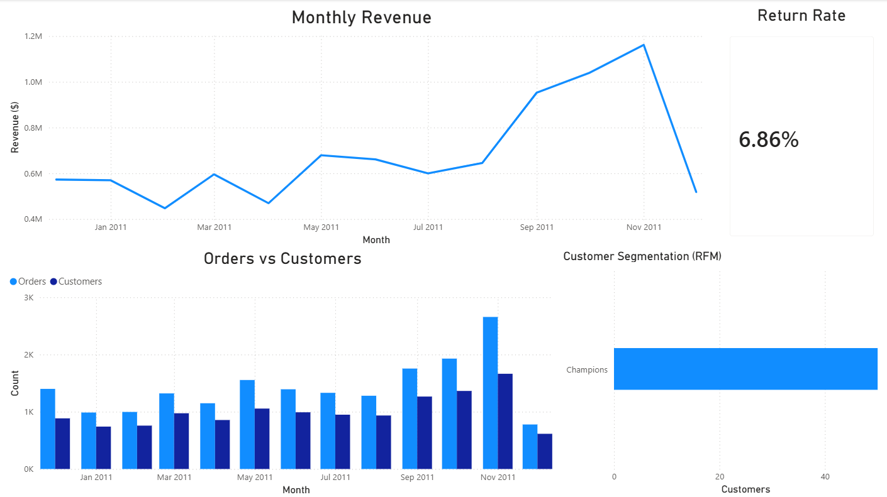

# SQL Customer Sales Analytics (PostgreSQL)

## Dashboard Preview

Power BI dashboard built from SQL analysis showing monthly revenue trends, order activity, and customer segmentation using RFM scoring.

## Overview
This project analyzes retail transaction data using PostgreSQL to identify revenue trends, customer behavior, and product performance. The analysis demonstrates common data analyst workflows including data cleaning, KPI reporting, and customer segmentation using SQL.

The dataset contains over 500,000 retail transaction records including product purchases, quantities, prices, and customer IDs.

## Tools Used
- PostgreSQL
- SQL (CTEs, aggregations, window functions)
- Excel (for exporting query results)

## Project Structure
sql-customer-sales-analytics
│
├── sql
│   ├── 00_setup.sql        -- Database schema and raw table setup
│   ├── 01_cleaning.sql     -- Data cleaning and typed dataset creation
│   ├── 02_kpis.sql         -- Business KPI analysis
│   └── 03_rfm.sql          -- Customer segmentation using RFM scoring
│
├── outputs
│   ├── monthly_kpis.csv
│   └── rfm_top50.csv
│
└── README.md

## Analysis Steps

### 1. Data Import
The dataset was imported into PostgreSQL as a raw staging table (`retail_raw`) to allow flexible data cleaning and type conversion.

### 2. Data Cleaning
Data was cleaned and converted into proper types including:
- numeric quantities
- numeric prices
- timestamp invoice dates

Invalid or incomplete rows were filtered out and two views were created:
- `v_sales_clean` for valid transactions
- `v_returns` for product returns

### 3. Key Performance Indicators
Several core business metrics were calculated:

- Monthly revenue trends
- Order counts
- Customer counts
- Average order value
- Top customers by revenue
- Top products by revenue
- Revenue by country
- Return rate

Example result:
Return rate by revenue ≈ **6.86%**

### 4. Customer Segmentation (RFM Analysis)
Customers were segmented using the RFM framework:

- **Recency** – how recently a customer purchased
- **Frequency** – number of orders
- **Monetary** – total spending

Window functions (`NTILE`) were used to assign R, F, and M scores to each customer. Customers were then grouped into segments such as:

- Champions
- Loyal
- Potential
- At Risk

This type of analysis is commonly used in marketing and retention strategy.

## Example Outputs

### Monthly KPIs
See: `outputs/monthly_kpis.csv`

### Top Customer Segmentation
See: `outputs/rfm_top50.csv`

## Key SQL Concepts Demonstrated
- Data cleaning with type casting
- Common Table Expressions (CTEs)
- Aggregations and grouping
- Window functions (`NTILE`)
- Analytical SQL for business insights